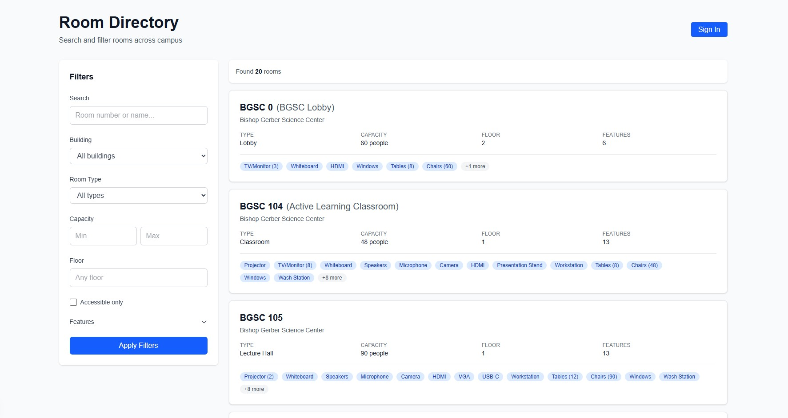
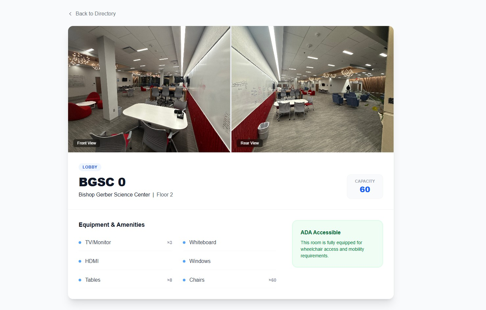
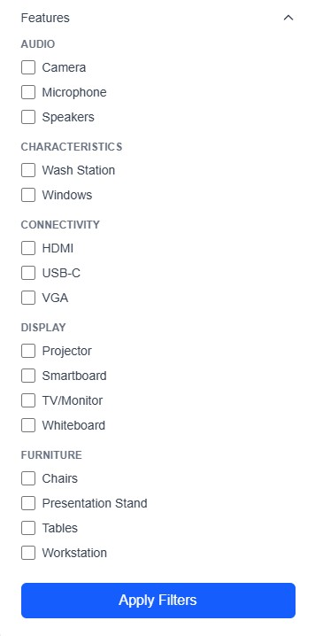

# 🏛️ Campus Room Directory (RCD)

A modern, full-stack web application designed to help students and staff navigate campus infrastructure. This app allows users to search, filter, and view high-detail profiles of every room on campus, including equipment lists and visual layouts.

---

## 📸 Project Showcase 1/3/2026

### 1. Main Directory & Search
The central hub featuring real-time server-side filtering. Users can narrow down rooms by building, minimum capacity, floor, or specific accessibility requirements.

### 2. Room Detail Page
A dedicated, dynamic profile for every room. By utilizing **Dynamic Routing**, each room ID generates a unique view featuring high-resolution front and back photos, specific notes, and capacity stats.

### 3. Equipment & Amenities
A categorized breakdown of "Features." This shows the power of our relational database, linking rooms to specific equipment like AV hardware, lab tools, and furniture types.

---

## 🛠️ Tech Stack

* **Framework:** [Next.js 16.0.3](https://nextjs.org/) (App Router)
* **Database:** [Neon Postgres](https://neon.tech/) (Serverless)
* **ORM:** [Drizzle ORM](https://orm.drizzle.team/)
* **Styling:** [Tailwind CSS](https://tailwindcss.com/)
* **Language:** [TypeScript](https://www.typescriptlang.org/)

---

## 🚀 Key Features

* **Dynamic Routing**: Handles thousands of room profiles using a single `[id]` template.
* **Server Actions**: Secure, server-side data fetching and searching.
* **Relational Mapping**: Complex filtering that joins Buildings, Rooms, and Features seamlessly.
* **Responsive UI**: Optimized for campus use on both desktop and mobile devices.
* **Accessibility First**: Clear indicators for ADA-compliant rooms and limited-access areas.
